  

  

---

## 👨‍💻 Backend Engineer | Java | Spring Boot | Microservices

> Building scalable, secure, and high-performance backend systems with clean architecture.

---

## 👨‍💻 Who I Am (in engineering terms)

I am a backend engineer focused on building **real-world, production-grade systems** using Java and Spring Boot.

I don’t just write APIs — I design systems that are:

- ⚙️ Scalable under real traffic
- 🔐 Secure by design (not afterthought)
- 🚀 Optimized for performance and low latency
- 🧩 Structured with clean architecture principles

---

### 🏗️ What I’m Currently Focused On

- Designing **microservice-based architectures**
- Building **secure authentication systems (JWT, OAuth2, Refresh Rotation)**
- Working with **Kafka, Redis, and distributed patterns**
- Improving system design skills for FAANG-level backend roles

---

### 🧠 Engineering Philosophy

> “A backend system is not just code — it’s a contract between performance, reliability, and scale.”

I prioritize:
- Clean design over quick hacks  
- System thinking over feature coding  
- Reliability over complexity  

---

### 🚀 Goal

To become a **high-impact backend engineer** capable of designing systems that scale from **0 → millions of users** while maintaining simplicity and control.

---

### ⚡ Current Mindset

- Build like production systems, not tutorials  
- Think in distributed systems, not single services  
- Treat every project like a real company system  

## ⚙️ Tech Stack

<!-- 

  

 -->

  

---

## 💡 What I Do

- ⚡ Build high-performance REST APIs with Spring Boot  
- 🔐 Design secure authentication & authorization systems (JWT, OAuth2)  
- 🧠 Work with distributed systems, caching & messaging (Redis, Kafka)  
- 🏗️ Follow clean architecture & microservices patterns  
- 🚀 Optimize backend systems for scalability & low latency  

---

## 📊 GitHub Stats

<!-- 

  
  

 -->

  
  

---

## 📈 Activity Graph

  

---

## 📫 Connect With Me

---

<!-- Clean, minimal, backend-focused professional profile -->
